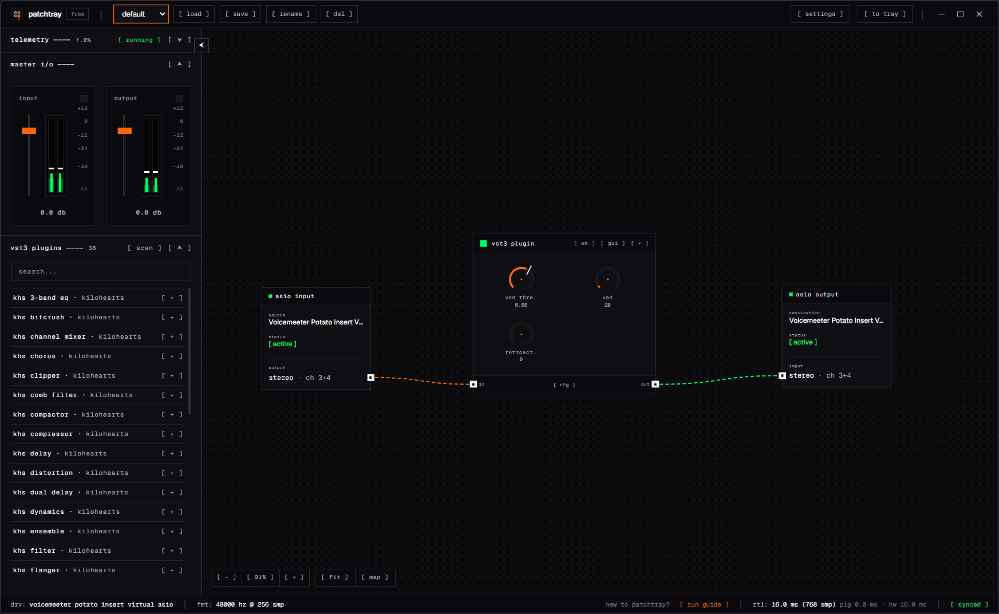

<p align="center">
  
</p>

<p align="center">
  <a href="https://www.patchtray.io"><strong>Website</strong></a>
  ·
  <a href="https://github.com/PatchTray/PatchTray/releases/latest"><strong>Download</strong></a>
  ·
  <a href="https://www.patchtray.io/guides"><strong>Guides</strong></a>
  ·
  <a href="https://www.patchtray.io/support"><strong>Support</strong></a>
</p>

# PatchTray website

This repository contains the public website for PatchTray, a Windows VST3 host
for building visible, real-time ASIO audio routes.

The site provides:

- a product overview and current Windows download;
- PatchTray setup and live-audio workflow guides;
- answers about VST3 hosting, ASIO routing, licensing, and compatibility; and
- support, privacy, terms, and refund information.

<p align="center">
  
</p>

## PatchTray

PatchTray connects an ASIO input, a live VST3 processing chain, and an ASIO
output in one visual route. Processing can continue while the application is
minimized to the Windows system tray.

The public release repository contains downloads, updater metadata, approved
media assets, and issue tracking:

- [PatchTray releases](https://github.com/PatchTray/PatchTray/releases/latest)
- [PatchTray public repository](https://github.com/PatchTray/PatchTray)
- [Getting started](https://www.patchtray.io/guides/build-your-first-vst3-chain)
- [Support](https://www.patchtray.io/support)

## Website development

Install dependencies and start the published-content development server:

```sh
npm install
npm run dev
```

Use `npm run dev:blog` to review draft articles locally. See the
[blog authoring guide](content/blog/README.md) for the content format,
preview workflow, validation commands, and publication checklist.

© 2026 CyR1en.
